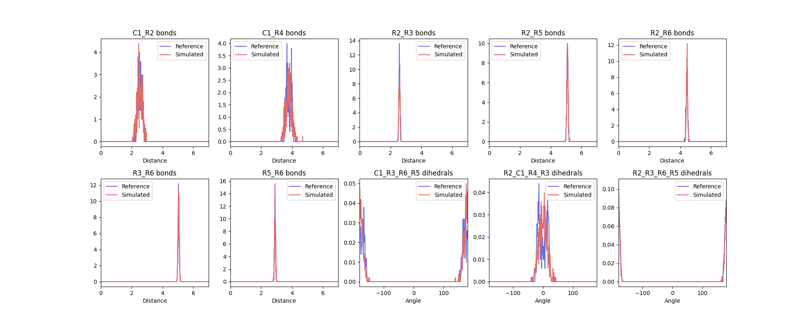
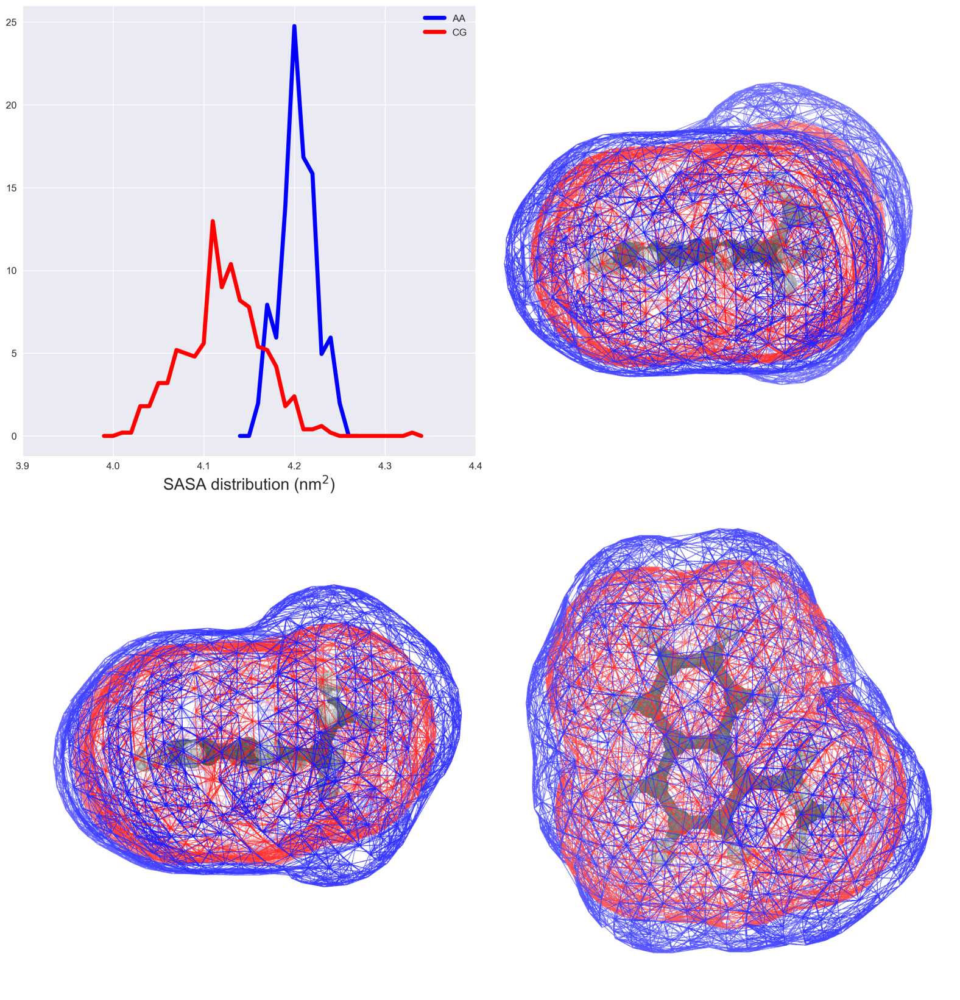

<hr>
In case of issues, please contact [riccardo.alessandri@kuleuven.be](mailto: riccardo.alessandri@kuleuven.be) or open an [issue on the repo](https://github.com/Martini-Force-Field-Initiative/Martini-Force-Field-Initiative.github.io/issues).
<hr>

### Summary
- [`Introduction`](#introduction)
- [`Generate atomistic reference data`](#generate-atomistic-reference-data)
- [`Atom-to-bead mapping`](#atom-to-bead-mapping)
- [`Generate the CG mapped trajectory from the atomistic simulation`](#generate-the-cg-mapped-trajectory-from-the-atomistic-simulation)
- [`Create the initial CG itp and tpr files`](#create-the-initial-cg-itp-and-tpr-files)
- [`Generate target CG distributions from the CG mapped trajectory`](#generate-target-cg-distributions-from-the-cg-mapped-trajectory)
    - [`On the choice of bonded terms for the CG model`](#on-the-choice-of-bonded-terms-for-the-cg-model)
    - [`Index files and generation of target distributions`](#index-files-and-generation-of-target-distributions)
- [`Create the CG simulation`](#create-the-cg-simulation)
- [`Optimize CG bonded parameters`](#optimize-cg-bonded-parameters)
- [`Comparison to experimental results, further refinements, and final considerations`](#comparison-to-experimental-results-further-refinements-and-final-considerations)
    - [`Partitioning free energies`](#partitioning-free-energies)
    - [`Molecular volume and shape`](#molecular-volume-and-shape)
- [`Using Bartender to generate bonded parameters`](#using-bartender-to-obtain-bonded-parameters-for-a-small-molecule)
    - [`Installing Bartender`](#installing-bartender)
    - [`Preparing Bartender input files`](#preparing-bartender-input-files)
    - [`Running Bartender`](#running-bartender)
    - [`Analyzing the resulting files`](#analyzing-the-resulting-files)
- [`Tools and scripts used in this tutorial`](#tools-and-scripts-used-in-this-tutorial)
- [`References`](#references)

### Introduction
<hr>

In this tutorial, we will discuss how to build a Martini 3 topology for a new small molecule. The aim is to have a pragmatic description of the Martini 3 coarse-graining (CGing) principles <sup>[[1,2]](#references)</sup>, which follow the main ideas outlined in the seminal Martini 2 work <sup>[[3]](#references)</sup>. Among other things, you may want to parametrize a small molecule with Martini 3 in order to perform protein-ligand binding simulations <sup>[[4]](#references)</sup> or perhaps test the solubility of a molecular dopant in different environments <sup>[[5]](#references)</sup>.

We will use as an example the molecule *1-ethylnaphthalene* (Fig. 1), and make use of `Gromacs` versions 2024.x or later. Required files and worked examples can be downloaded [here](https://cgmartini-library.s3.ca-central-1.amazonaws.com/0_Tutorials/m3_tutorials/Parametrize_Small_Molecule/parametrize_new_small_molecule.zip), and files for Bartender can be obtained [here](https://cgmartini-library.s3.ca-central-1.amazonaws.com/0_Tutorials/m3_tutorials/Parametrize_Small_Molecule/m3_bartender.zip).


### 1. Generate atomistic reference data
<hr>

We will need atomistic reference data to extract bonded parameters for the CG model. Note that we will need all the hydrogen atoms to extract bond lengths further down this tutorial, so make sure that your atomistic structure contains all the hydrogens.

Here, we will use the [SwissParam server](https://swissparam.ch/) as a way to obtain an atomistic (or all-atom, AA) structure and molecule topology based on the Charmm36 force field, but of course feel free to use your favorite atomistic force field. Other web-based services such as [LigParGen](https://zarbi.chem.yale.edu/ligpargen/), the [automated topology builder (ATB)](https://atb.uq.edu.au/), or [CHARMM-GUI](https://www.charmm-gui.org/) can also be used to obtain reference topologies based on other AA force fields. Another important option is to look in the literature for atomistic studies of the molecule you want to parametrize: if you are lucky, somebody might have already published a validated atomistic force field for the molecule, which you can then use to create reference atomistic simulations.

Start by feeding the SMILES string for *1-ethylnaphthalene* (namely, `CCc1cccc2ccccc21`) to the SwissParam server. After submitting the molecule, the server will generate input parameters for several molecular dynamics (MD) packages. Download the resulting zip file. You can now unzip the zip archive provided:

``` bash
unzip files-m3-parametrize_new_small_molecule.zip
```

which contains a folder called `ENAP-in-water` that contains some template folders and useful scripts. We will assume that you will be carrying out the tutorial using this folder structure and scripts. Note that the archive contains also a folder called `ENAP-worked` where you will find a worked version of the tutorial (trajectories not included). This might be useful to use as reference to compare your files (e.g., to compare the `ENAP_LigParGen.itp` you obtained with the one you find in `ENAP-worked/1_AA-reference`).

We can now move to the first subfolder, `1_AA-reference`, and copy over the files you just obtained from the LigParGen server:

``` bash
cd ENAP-in-water/1_AA-reference
```
> [move here the obtained zip file from the SwissParam server.]

Input files obtained from `SwissParam` come with a default residue name of `LIG`. For now, this does not particularly matter, but it may be useful to change it for record keeping or future reference.

Now launch the AA MD simulation:

``` bash
bash generate_atomistic_reference.sh
```

The last command will run an energy-minimization, followed by an NPT equilibration of 250 ps, and by an MD run of 10 ns (inspect the script and the various `.mdp` files to know more). Note that 10 ns is a rather short simulation time, selected for speeding up the current tutorial. You should rather use at least 50 ns, or an even longer running time in case of more complex molecules (you can try to experiment with the simulation time yourself!). In this case, the solvent used is water; however, the script can be adapted to run with any other solvent, provided that you input also an equilibrated solvent box. You should choose a solvent that represents the environment where the molecule will spend most of its time. Finally, a solvent-free trajectory is generated to use for mapping purposes later.

### 2. Atom-to-bead mapping
<hr>

Mapping, *i.e.*, splitting the molecule in building blocks to be described by CG beads, is the heart of coarse-graining and relies on experience, chemical knowledge, and trial-and-error. Here are some guidelines you should follow when mapping a molecule to a Martini 3 model:

* only non-hydrogen atoms are considered to define the mapping;
* avoid dividing specific chemical groups (*e.g.*, amide or carboxylate) between two beads;
* respect the symmetry of the molecule; it is moreover desirable to retain as much as possible the volume and shape of the underlying AA structure;
* default option for 4-to-1, 3-to-1 and 2-to-1 mappings are regular (R), small (S), and tiny (T) beads; they are the default option for linear fragments, *e.g.*, the two 4-to-1 segments in octane;
* R-beads are the best option in terms of computational performance, with the bead size reasonably good to represent 4-to-1 linear molecules;
* T-beads are especially suited to represent the flatness of aromatic rings;
* S-beads usually better mimic the "bulkier" shape of aliphatic rings;
* the number of beads should be optimized such that the maximum mismatch in mapping is ±1 non-hydrogen atom per 10 non-hydrogen atoms of the atomistic structure;
* fully branched fragments should usually use beads of smaller size (the rational being that the central atom of a branched group is buried, that is, it is not exposed to the environment, reducing its influence on the interactions); for example, a neopentane group contains 5 non-hydrogen atoms but, as it is fully branched, you can safely model it as a regular bead.

In this example, first of all it is important to realize that, within Martini 3, conjugated, atom-thick structures are best described by Tiny (T) beads. This ensures packing-related properties closely matching atomistic data <sup>[[1,2]](#references)</sup>. In this case, the 10 carbon atoms of the naphthalene moiety are therefore mapped to 5 T-beads, as shown in Fig. 2 below:

<!-- insert figure with html to modify width -->
<figure>
    <center>
    
    <figcaption>Figure 2 | Atom-to-bead mapping of the 1-ethylnaphthalene.</figcaption>
    </center>
</figure>

Which leaves us with the ethyl group. A T-bead is again a good choice because the T-bead size is suited for describing 2 non-hydrogen atoms. Note that, the beads have also been numbered in the figure for further reference.

A good idea to settle on a mapping is to draw your molecule a few times on a piece of paper, come up with several mappings, compare them, and choose the one that best fulfills the guidelines outlined above.

### 3. Generate the CG mapped trajectory from the atomistic simulation
<hr>

Using the mapping you just created, you will now transform the simulation you did at [section 1](#generate-atomistic-reference-data) to CG resolution. One way to do this is by creating a Gromacs (AA-to-CG) index file where every index group stands for a bead and contains the mapped atom numbers.

Instead of creating an index file by hand from scratch, an initial AA-to-CG index file can be obtained with the [CGbuilder tool](https://jbarnoud.github.io/cgbuilder/) <sup>[[7]](#references)</sup>. The intuitive GUI allows to map a molecule on the virtual environment almost as one does on paper. Just load the solvent-free `lig.gro` file of the molecule, click on the atoms you want to be part of the first bead, click again to remove them if you change your mind, create the next bead by clicking on the "new bead" button, and so on; finally, download the files once done. In fact, the tool allows also to obtain an initial CG configuration (a `.gro` file) for the beads and a CG-to-AA mapping file (a `.map` file) based on the chosen mapping. Doesn't this sound better than traditional paper?! Current caveats of `CGbuilder` include the fact that atoms cannot contribute with a weight different from 1 to a certain bead, something which is sometimes needed when mapping atomistic structures to Martini. In such cases, the index and/or mapping files should be subsequently refined by hand.

Before you get to it: **an important change in Martini 3 with respect to Martini 2.x** is the fact that now hydrogen atoms are taken into account to determine the relative position of the beads when mapping an atomistic structure to CG resolution <sup>[[1,2]](#references)</sup> - more on this later in this Section. This should be reflected in your AA-to-CG index file, that is, your index should also contain the hydrogens (in `CGbuilder` terms, click also on the hydrogens!). The general rule is to map a certain hydrogen atom to the bead which contains the non-hydrogen atom it is attached to.

You can now try to map the trajectory using a `.map` file from `CGBuilder`. Once done, download the `cgbuilder.map` file that `CGbuilder` creates to the `2_mapping` folder.

``` bash
cd ../2_mapping/
```
> [download cgbuilder.map and move it to the current folder, i.e., '2_mapping']

and compare the mapping file obtained to the ones provided in `ENAP-worked/2_mapping` where, besides the files we just explained, you can also find a screenshot (`ENAP_cgbuilder.png`) of the mapping as done with the `CGbuilder` tool. **Note also that the files provided assume the beads to be ordered in the same way as shown in [Fig. 2](#atom-to-bead-mapping)**; it is hence recommended to use the same order to greatly facilitate comparisons.

The header of `CGbuilder` .map files doesn’t quite align with what we exactly need for `fast_forward`. Make sure the first two lines of the file read as:

``` bash
[ molecule ]
LIG ENAP
```

These lines define the name of the molecule at atomistic (`LIG`) and CG (`ENAP`) resolution.

You can now run the script:

``` bash
bash 2_mapping.sh
```

which will:

 1. Make a python virtual environment and install the fast forward package in it.
 2. Use the `ff_map` program of `fast_forward` to map the ligand-only trajectory generated in the previous step.

Note that running `ff_map` on a trajectory file automatically generates both the mapped trajectory and a single initial frame. Note in the `mapped.gro` file generated the residue name is now `ENAP`, having been defined in the `.map` file above.

### 4. Generating an initial CG topology
<hr>

GROMACS `.itp` files are used to define components of a topology as a separate file. In this case we will create one to define the topology for our molecule of interest, that is, define the atoms (that, when talking about CG molecules, are usually called *beads*), atom types, and properties that make up the molecule, as well as the bonded parameters that define how the molecule is held together.

The creation of the CG `.itp` file has to be done by hand, although some copy-pasting from existing `.itp` files might help in getting the format right. A thorough guide on the GROMACS specification for molecular topologies can be found in the [GROMACS reference manual](https://manual.gromacs.org/documentation/current/reference-manual/topologies/topology-file-formats.html), however, this tutorial will guide you through the basics.

The first entry in the `.itp` is the `[ moleculetype ]`, one line containing the molecule name and the number of nonbonded interaction exclusions. For Martini topologies, the standard number of exclusions is 1, which means that nonbonded interactions between particles directly connected are excluded. For our example this would be:

``` bash
[ moleculetype ]
; molname    nrexcl
  ENAP         1
```

The second entry in the `.itp` file is `[ atoms ]`, where each of the particles that make up the molecule are defined. One line entry per particle is defined, containing the *beadnumber*, *beadtype*, *residuenumber*, *residuename*, *beadname*, *chargegroup*, *charge*, and *mass*. For each bead we can freely define a *beadname*. The residue number and residue name will be the same for all beads in small molecules, such as in this example.

In Martini, we must also assign a bead type for each of the beads. This assignment follows the "Martini 3 Bible" (from Refs. <sup>[[1,2]](#references)</sup>), where initial bead types are assigned based on the underlying chemical building blocks. You can find the "Martini 3 Bible" in the form of a table [at this link](https://github.com/ricalessandri/Martini3-small-molecules/blob/main/tutorials/building_block_table.pdf). In this example, bead number 1 represents the ethyl group substituent; according to the "Martini 3 Bible" ethyl groups are represented by TC3 beads. Check the table yourself to see which bead types to use to describe the remaining beads. For a lengthier discussion of bead choices, see the final section of this tutorial.

Each bead will also have its own charge, which in this example will be 0 for all beads. Mass is usually not specified in Martini; in this way, default masses of 72, 54, and 36 a.m.u. are used for R-, S-, and T-beads, respectively. However, when defined the mass of the beads is typically the sum of the mass of the underlying atoms.

For our example, the atom entry for our first bead would be:

``` bash
[ atoms ]
; nr type resnr residue atom cgnr charge mass
   1  TC2   0    ENAP   C1    1    0
...
```

These first two entries in the `.itp` file are mandatory and make up a basic `.itp`. Finish building your initial CG `.itp` entries and name the file `ENAP_initial.itp`. The `[ moleculetype ]` and `[ atoms ]` entries are typically followed by entries which define the bonded parameters: `[ bonds ]`, `[ constraints ]`, `[ angles ]`, and `[ dihedrals ]`.


### 4.1. Structuring a CG topology file for Gromacs

We need to obtain the parameters of the bonded interactions (*bonds*, *constraints*, *angles*, *proper* and *improper dihedrals*) which we want in our CG model from our mapped-to-CG atomistic simulations from [section 3](#generate-the-cg-mapped-trajectory-from-the-atomistic-simulation)). However, which bonded terms do we need to have? Let's go back to the drawing board and identify between which beads there should be bonded interactions.

#### 4.1.1 On the choice of bonded terms for the CG model
<hr>

The bonds connecting the T-beads within the 1-ethyl-naphthalene moiety are most likely going to be very stiff, that is, their distributions are going to be very narrow. This calls for the use of constraints <sup>[[1-3]](#references)</sup>. A "naive" way of putting the model together would be to constrain all the beads (see Fig.3A below):


such a model, however, is prone to numerical instabilities, because it is increasingly complicated for the constraint algorithm to satisfy a growing number of connected constraints. Another option is to build a "hinge" model <sup>[[2]](#references)</sup> (inspired by the work of **Melo et al.** <sup>[[8]](#references)</sup>) where the 4 external beads (beads 2, 3, 5, and 6 of Fig. 3) are connected by 5 constraints to form a "hinge" construction, while the central bead (bead number 4) is described as a virtual site, that is, a particle whose position is completely defined by its constructing particles (Fig. 3B above). The use of virtual particles not only improves the numerical stability of the model but also improves performance <sup>[[2]](#references)</sup>. As virtual sites are mass-less, the mass of the virtual site should be shared among the four constructing beads, so that beads 2, 3, 5, and 6 should have each a mass of 45 (= 36 + 36/4, where 36 is the mass of a T-bead).

Bead 1 can then be connected by means of two bonds, namely 1-2 and 1-4. Two improper dihedrals (1-3-6-5 and 2-1-4-3) will be required in order to keep bead 1 on the right position onto the naphthalene ring. A final improper dihedral 2-3-6-5 will also be needed to keep the naphthalene ring flat. Exclusions between all beads should also be applied in this case, as the molecule is quite stiff and having intramolecular interactions in this case is not needed.

Having decided on the bonded terms to use, they must now be defined in the `.itp` file under the `[ bonds ]`, `[ constraints ]`, `[ angles ]`, `[ dihedrals ]`, and `[ virtual_sitesn ]` entries. In general, each bonded potential is defined by stating the atom number of the particles involved, the type of potential involved, and then the parameters involved in the potential, such as reference bond lengths/angle values or force constants. This definition is highly dependent on the type of potentials employed and, as such, users should always reference the [`GROMACS` manual for specific details](https://manual.gromacs.org/documentation/current/reference-manual/topologies/topology-file-formats.html). Here, we will use this example to cover the most common potentials used in defining Martini topologies.

Bonds are defined under `[ bonds ]` by stating the atom number of the particles involved, the type of bond potential (in this case, type 1, a regular harmonic bond) followed by the reference bond length and force constant. Constraints are defined similarly to bonds, under the `[constraints ]` section, with the exception that no force constant is needed. If we use bond 1-2 and constraint 2-3 as examples, your `.itp` could look something like this:

``` bash
[bonds]
; i j funct length kb
 1 2 1 0.300 5000
...

[constraints]
; i j funct length
 2 3 1 0.300
...
```

Angles and dihedrals follow the same strategy, stating the atom number of the particles involved, the type of potential, and, in this case, the reference angle and force constant. While there are no angles defined in this example, we have 3 improper dihedral potentials in place (regular and improper dihedral potentials correspond to dihedral function types 1 and 2, respectively):

``` bash
[ dihedrals ]
; improper
; i j k l funct ref.angle force_k
 1 3 6 5 2 0 10
...
```

Virtual sites are defined slightly differently. In this case, you define the atom number of the virtual site, followed by the type of virtual site, and the atom numbers of the constructing particles. In our case:

``` bash
[ virtual_sitesn ]
; site funct constructing atom indices
 4 1 2 3 5 6
```

Finally, to apply exclusions, we state the atom number of the target particle followed by the numbers of the atoms from which the target particle is to be excluded:

``` bash
[ exclusions ]
 1 2 3 4 5 6
```

The initial topology can then be used to generate a gromacs tpr file ready to be used with fast_forward.


### 4.2 Using fast_forward to generate initial parameters

One of the powerful features of fast_forward is the `ff_inter` (interactions) program, which can generate best guess parameters for a CG topology file from an initial input topology and a mapped trajectory.

The initial input topology can be readily adapted from the file that we’ve just generated. Two additional considerations are:

 1. All interactions (*bonds*, *angles*, *dihedrals*, etc) need to be annotated with an interaction group name
 2. Bonds may be left as bonds only, `ff_inter` will automatically convert high force constants to constraints.


The first interactions directive of the file can then look something like this:

``` bash
[bonds]
; i j funct length kb
 1 2 1 0.300 5000 ; C1_R1
 1 4 1 0.300 5000 ; C1_R4
 2 3 1 0.300 5000 ; R2_R3
…
[ dihedrals ]
; i j k l func ref.angle force_const
 1 3 6 5 2 0 10 ; C1_R3_R6_R5
…
```
Note as well that the initial guesses here are completely arbitrary. Any interaction will be analysed *ab initio* with new parameters calculated.

The `ff_inter` program can then be invoked with the following command:

``` bash
ff_inter -f ../2_mapping/mapped.xtc -s mapped.tpr -i ENAP_initial.itp -dists -plots -itp-only
```

Here, the mapped trajectory and associated topology (`mapped.xtc` and `mapped.tpr` respectively) are analysed using the interactions notated in the input molecule topology file (`ENAP_initial.itp`). Using the `-dists` flag writes out time series and histogram data for each of the interactions. The histograms are all also plotted in a figure using the `-plots` flag: a file called `distribution_plots.png` is written. For each interaction, the histogram of the interaction data is plotted along with the fit the program has made. Finally, the `-itp-only` flag indicates that strictly *only* the interactions notated in the input file should be determined. Otherwise, `ff_inter` will attempt to generate all possible angles and dihedrals for the molecule from its bonded structure, a feature of the program which may be useful for slightly larger or more flexible molecules.

The program will generate a new itp file based on the molecule name (i.e. `ENAP.itp`). Compare the input and the output file. The output file should now contain both bonds and constraints, with some bonds separated by an `#ifdef` statement for energy minimisation purposes, and written in the constraints directive with the inverse statement. The bond lengths and force constants should now be more ‘optimised’ for an initial simulation, with respect to the distributions calculated and shown in the figure generated.


### 5. Create the CG simulation
<hr>


We can now finalize the first take on the CG model, `ENAP_take1.itp`, where we can use the info contained in the `data_bonds.txt` and `data_dihedrals.txt` files to come up with better guesses for the bonded parameters:

``` bash
cd ../4_CG_sim
```
``` bash
cp ../3_initial_CG/ENAP.itp.
```
``` bash
bash run_CG.sh
```

where the command will run an energy-minimization, followed by an NPT equilibration, and by an MD run of 100 ns (inspect the script and the various `.mdp` files to know more) for the Martini system in water. Finally, a ligand-only trajectory and topology are generated for comparison to the mapped ones made earlier.

### 6. Optimize CG bonded parameters
<hr>

You can now compare the simulated distributions to the reference ones using the final program of the fast_forward package, `ff_assess`. Use the following command:

``` bash
ff_assess -f prod/lig_CG.xtc -s prod/lig_CG.tpr -i ENAP.itp -d ../3_initial_CG/ -plots
```

The `ff_assess` program simply uses the annotated topology of the molecule to calculate the interactions actually obtained during the CG simulation, and plots them against the reference distributions previously generated by `ff_inter` (given in a file path to the `-d` flag). Finally, a score is generated using the [Hellinger distance](https://en.wikipedia.org/wiki/Hellinger_distance) comparing the simulated and mapped distributions.

The plot produced should look like this:

<!-- insert figure with html to modify width -->
<figure>
    <center>
    
    <figcaption>Figure 4 | CG simulation vs. mapped bonded distributions.</figcaption>
    </center>
</figure>
The agreement is very good, noted from both the figure above and also the report of the distribution distance scores generated.

Note that the bimodality of the distributions of the first two dihedrals cannot be captured by the CG model. However, the size of the CG distribution will seemingly capture the two AA configurations into the single CG configuration. If the agreement is not satisfactory at the first iteration - which is likely to happen - you should play with the equilibrium value and force constants in the CG `.itp` and iterate till satisfactory agreement is achieved.

### 7. Comparison to experimental results, further refinements, and final considerations
<hr>

#### 7.1 Partitioning free energies
<hr>

Partitioning free energies (see [tutorial on how to compute them](../../Legacy/martini2/free_energy.qmd)) constitute particularly good reference experimental data. In the case of 1-ethyl-naphthalene, a model using 5 TC5 beads for the naphthalene ring, and a TC3 bead for the ethyl group, leads to the following (excellent!) agreement with available partitioning data (the experimental values are from Ref. <sup>[[9]](#references)</sup>):

<table>
<thead>
<tr><th>logHD (kJ/mol)</th><th>&nbsp;</th><th>&nbsp;</th><th>logP (kJ/mol)</th><th>&nbsp;</th><th>&nbsp;</th></tr>
</thead>
<tbody>
<tr>
<td><strong>Exp.</strong></td>
<td><strong>CG</strong></td>
<td><strong>Err.</strong></td>
<td><strong>Exp.</strong></td>
<td><strong>CG</strong></td>
<td><strong>Err.</strong></td>
</tr>
<tr>
<td>25.2</td>
<td>25.8</td>
<td>0.6</td>
<td>25.2</td>
<td>24.4</td>
<td>-0.6</td>
</tr>
</tbody>
</table>

#### 7.2 Molecular volume and shape
<hr>

The approach described so far is oriented to high-throughput applications where this procedure could be automated. However, COG-based mappings cannot necessarily always work perfectly. In case packing and/or densities seem off, it is advisable to look into how the molecular volume and shape of the CG model compare to the ones of the underlying AA structure.

To this end, we can use the Gromacs tool `gmx sasa` to compute the solvent accessible surface area (SASA) and the Connolly surface of the AA and CG models. While AA force fields can use the default `vdwradii.dat` provided by Gromacs, for CG molecules, such file needs to be modified. The radii for the Martini R-, S-, and T-beads are 0.264, 0.230, and 0.191 nm, respectively. Take a look at `ENAP-worked/5_SASA/CG/vdwradii_CG.dat` in case of doubts. A small Python script, `make_cg_sasa_file.py` is provided to automate this process.

We also recommend using an updated `vdwradii.dat` for the atomistic reference calculations, instead of the Gromacs default. The file - that you can find among the provided files with the name `vdwradii_AA.dat` - uses more recent vdW radii from [Rowland and Taylor, J. Phys. Chem. 1996, 100, 7384-7391](https://doi.org/10.1021/jp953141+).

Now, run:

``` bash
bash 5_do_sasa.sh
```

that will compute the SASA and Connolly surfaces for both the CG and AA models. The SASA will be compute along the trajectory, with a command that in the case of the AA model looks like this:

``` bash
gmx sasa -f ../../1_AA_reference/prod/lig.xtc -s ../../1_AA_reference/prod/lig.tpr -ndots 4800 -probe 0.191  -o SASA-AA.xvg
```

Note that the probe size is the size of a T-bead (the size of the probe does not matter but you must consistently use a certain size if you want to meaningfully compare the obtained SASA values), and the `-ndots 4800` flag guarantees accurate SASA value. You will instead see that the command used to obtain the Connolly surface uses fewer points (`-ndots 240`) to ease the visualization with softwares such as `VMD`. Indeed, we can now overlap the Connolly surfaces (computed by the script on the energy-minimized AA structure and its mapped version) by using the following command:

``` bash
vmd -m  1_AA_reference/prod/lig.gro  AA/surf-AA.pdb  CG/surf-CG.pdb
```

This should give you some of the views you find rendered below. Below you find also the plot of the distribution of the SASA along the trajectory (Fig. 6) - `distr-SASA-AA.xvg` and `distr-SASA-CG.xvg` -:



The SASA distributions show a discrepancy of about 5% (the average CG SASA is about 5% smaller than the AA one - see `data_sasa_AA.xvg` and `distr-SASA-CG.xvg`), which is acceptable, but not ideal. Inspecting the Connolly surfaces (AA in blue, CG in red) gives you a clearer picture: while the naphthalene moiety on average seems to be captured quite accurately by the CG model, the T-bead at index 1 does seem not to account for the whole molecular volume of the ethyl group. One way to improve this could be to lengthen bonds 1-2, and 1-4.

#### 7.3 Final considerations
<hr>

* Mapping of some chemical groups, especially when done at higher resolutions (*e.g.*, in aromatic rings), can vary based on the proximity of functional groups. The rule of thumb is that such perturbations may require a shift of ±1 in the degree of polarity of the bead in question.

* Take inspiration from already-developed models when trying to build a Martini 3 molecule for a new small molecule. Several examples can be found on the [Martini 3 small molecule GitHub repo](https://github.com/ricalessandri/Martini3-small-molecules/blob/main/models/martini_v3.0.0_small_molecules_v1.itp).

Besides hydrogen bonding labels ("d" for donor, and "a" for acceptor), electron polarizability labels are also made available in Martini 3: these mimic electron-rich (label "e") or electron-poor (label "v", for "vacancy") regions of aromatic rings. Such labels have been tested to a less extended degree than "d"/"a" labels, but have shown great potentials in applications involving aedamers <sup>[[1]](#references)</sup>. In the case of 1-ethylnaphthalene, the "e" label may be used to describe bead number 4 (at the center of the naphthalene moiety) and bead number 1 (because connected to an electron-donating group such as -CH2CH3).

* Depending on your application, you may want to include other validation targets, besides free energies of transfer. These can allow you to fine-tune and optimize bead type choices and bonded parameters. Below a non-exhaustive list of potential target properties:
    * if molecular stacking or packing are of importance, one can use use dimerization free energy landscapes as reference <sup>[[2]](#references)</sup>;
    * miscibility of binary mixtures has been successfully employed in the parameterization of martini CG solvent models <sup>[[1]](#references)</sup> - either by qualitative assessing the mixing behavior or by computing the excess free energy of mixing <sup>[[1-2]](#references)</sup>;
    * other experimental data such as the density of pure liquids or phase transition temperatures <sup>[[10]](#references)</sup> can be also used;
    * finally, more specific references are also used, such as the hydrogen-bonding strengths and specificity of interactions for nucleobases <sup>[[1]](#references)</sup>, following the Martini 2 DNA work <sup>[[11]](#references)</sup>.

### 8. Using Bartender to obtain bonded parameters for a small molecule
<hr>

Bartender is a program aimed at obtaining bonded parameters for Martini models while bypassing the atomistic force field development and simulation step. It does so by relying on (semi-empirical) quantum chemical calculations. Specifically, Bartender makes extensive use of the GFN family of methods from the Grimme group, implemented in their xtb program. If you use Bartender in your research we ask you to cite the relevant GFN papers <sup>[[12]](#references)</sup>.

Hence, this step of the tutorial can replace steps [1](#generate-atomistic-reference-data), [3](#generate-the-cg-mapped-trajectory-from-the-atomistic-simulation), and [5](#generate-target-cg-distributions-from-the-cg-mapped-trajectory) above.

#### 9.1 Installing Bartender
<hr>

To install `Bartender`, first uncompress the `m3_bartender.zip` provided in the [Introduction](#introduction) (if you did't download it then, you can also download it [here](https://cgmartini-library.s3.ca-central-1.amazonaws.com/0_Tutorials/m3_tutorials/Parametrize_Small_Molecule/m3_bartender.zip)) and access the `.tgz` file inside. Uncompress the `.tgz` file into a directory and set the `BTROOT` environment variable to point to that directory. Optionally, you can add `BTROOT` to `PATH`.

Let us go through this installation process. Say your home directory is `/home/alfred`, and you have the `Bartender` `.tgz` file in that folder (you can find the `.tgz` file among the downloaded files). Switch to that directory:

``` bash
cd /home/alfred
```

Create a `bartender` directory and move the `Bartender` `.tgz` file there:

``` bash
mkdir bartender
```
``` bash
mv bartenderX.Y.Z.tgz bartender/
```

Where X.Y.Z is the version number for your binary. Now enter the bartender directory and uncompress the binary:

``` bash
cd bartender
```
``` bash
tar xvzf bartenderX.Y.Z.tgz
```

Go back to the home directory and define the required environment variables. If you are using the Bash shell, that would be:

``` bash
cd
```
``` bash
echo "export BTROOT=/home/alfred/bartender" >> .bashrc
```
``` bash
echo "source $BTROOT/bartender_config.sh" >> .bashrc
```

Now use:

``` bash
source .bashrc
```

and `Bartender` is ready to use.

#### 9.2 Preparing Bartender input files
<hr>

In the following step you will need the `bartender` python script, and a few input files. You can find the necessary input files in the `m3_bartender.zip` file you downloaded in the previous step!

Bartender requires an input file and a geometry file.

The input file tells Bartender two things:

* the atom-to-bead mapping;
* the bonded terms you want to obtain.

The syntax of the Bartender input file is fairly simple, but we provide a script to automatically generate it from existing `.itp` and `.ndx` files. The `.itp` needs to contain the bonded terms, although, of course, you can assign any nonsensical value you want to each of the required constants. The ndx file contains the atom-to-bead mapping. Issuing the command (note that script requires `python3`, of course!):

``` bash
python3 ./write_bartender_inp.py --ndx ENAP_oplsaaTOcg_cgbuilder.ndx --itp ENAP_blank.itp --out ENAP_bartender.inp
```

will produce the required `ENAP_bartender.inp` input file. Notice that `gmx2bar` also asks for the number of atoms in the geometry file (24, in this case).

For the geometry file, Bartender supports the `.pdb`, `.gro`, and `.xyz` formats. Unfortunately, the `LigParGen` server generates non-standard `.pdb` files which `Bartender` cannot read. The easiest way to proceed is to transform these non-standard `.pdb` files into simpler `.xyz` files. This conversion is easy to do with a text editor that supports column selection, but you can also issue the command:

``` bash
awk 'BEGIN{COORDS="";NATOMS=0};NF==8{ COORDS=COORDS substr($3,1,1)" "$6" "$7" "$8"\n";NATOMS++}END{print NATOMS"\n\n"COORDS }' ENAP_LigParGen.pdb > ENAP.xyz
```

which calls the Unix utility `awk` and casts the non-standard ~ file onto an `.xyx` file. We now have everything Bartender needs!

#### 9.3 Running Bartender
<hr>

Bartender has many optional flags, but it is designed so they are rarely needed. Here, we can just use the basic command: `bartender geometry.pdb/.gro/.xyz bartender_input.inp`, which, in our case, will be:

``` bash
bartender ENAP.xyz ENAP_bartender.inp
```

#### 9.4 Analyzing the resulting files
<hr>

After a short wait (3-10 minutes depending on your CPU(s)), `Bartender` has produced several files, among which:

* A `gmx_out.itp` file: This is the topology file we were after, with the bonded parameters.
* A series of `.png` files. These files contain plots of the actual distributions for each term and each fit (red triangles) and the corresponding fitted function (blue lines).

If we open the `gmx_out.itp` file, we will see that Bartender will have generated bonded parameters for all the bonds, constraints, and impropers terms we have in the topology. How do the parameters compare to the ones you obtained by optimizing them by hand while using the atomistic simulation as a reference?


### Tools and scripts used in this tutorial
<hr>

- `GROMACS` ([http://www.gromacs.org/](http://www.gromacs.org/))

- `VMD` ([https://www.ks.uiuc.edu/Research/vmd/](https://www.ks.uiuc.edu/Research/vmd/))

- `Bartender` (downloadable [here](https://cgmartini-library.s3.ca-central-1.amazonaws.com/0_Tutorials/m3_tutorials/Parametrize_Small_Molecule/m3_bartender.zip))

### References
<hr>

[1] P.C.T. Souza, et al., Nat. Methods 2021, DOI: 10.1038/s41592-021-01098-3.

[2] R. Alessandri, et al., Chemrxiv 2021, DOI: 10.33774/chemrxiv-2021-1qmq9.

[3] S.J. Marrink, et al., J. Phys. Chem. B. 2007, 111, 7812-7824.

[4] P.C.T. Souza, S. Thallmair, et al., Nat. Commun. 2020, DOI: 10.1038/s41467-020-17437-5.

[5] J. Liu, et al., Adv. Mater. 2018, DOI: 10.1002/adma.201704630.

[6] W.L. Jorgensen and J. Tirado-Rives, PNAS 2005, 102, 6665; L.S. Dodda, et al., J. Phys. Chem. B, 2017, 121, 3864; L.S. Dodda, et al., Nucleic Acids Res. 2017, 45, W331.

[7] J. Barnoud, https://github.com/jbarnoud/cgbuilder.

[8] M.N. Melo, H.I. Ingolfsson, S.J. Marrink, J. Chem. Phys. 2015, 143, 243152.

[9] S. Natesan, et al., J. Chem. Inf. Model. 2013, 53, 6, 1424-1435.

[10] L.I. Vazquez-Salazar, M. Selle, et al., Green Chem. 2020, DOI: 10.1039/D0GC01823F.

[11] J.J. Uusitalo, et al., J. Chem. Theory Comput. 2015, 11, 8, 3932-3945.

[12]  [General reference] C. Bannwarth, et al., WIRES Comput. Mol. Sci. 2021, DOI: 10.1002/wcms.1493. [Solvation model] S. Ehlert, et al., Chemrxiv 2021, DOI: 10.26434/chemrxiv.14555355.v1. [GFN2-xTB] C. Bannwarth, et al., J. Chem. Theory. Comput. 2019, 15, 1652-1671. [GFNFF] S. Spicher and S. Grimme Ang. Chem. Int. Ed. 2020, 59, 15665-15673.

<hr>
